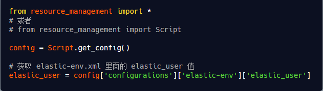
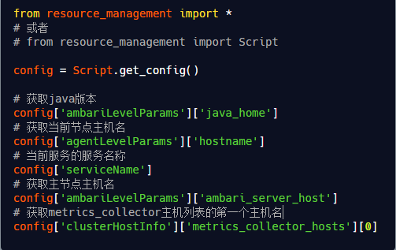
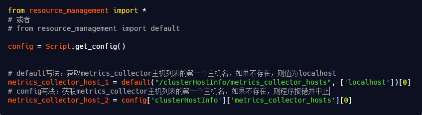
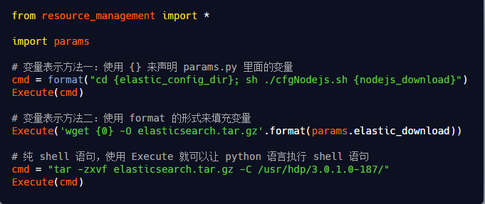
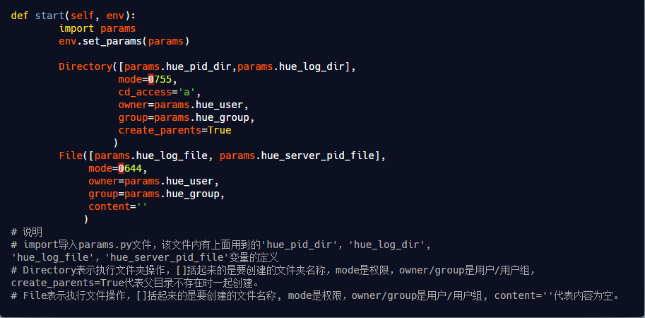
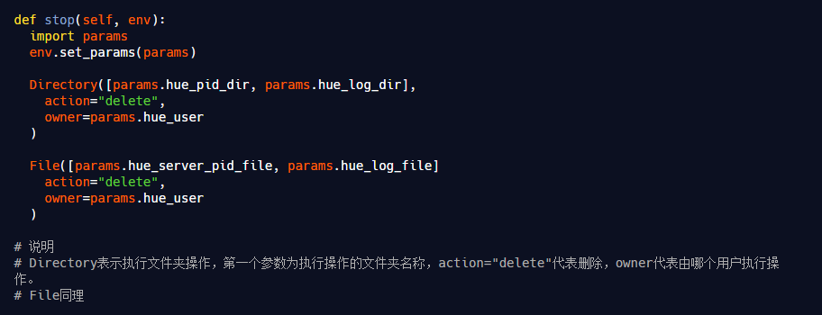
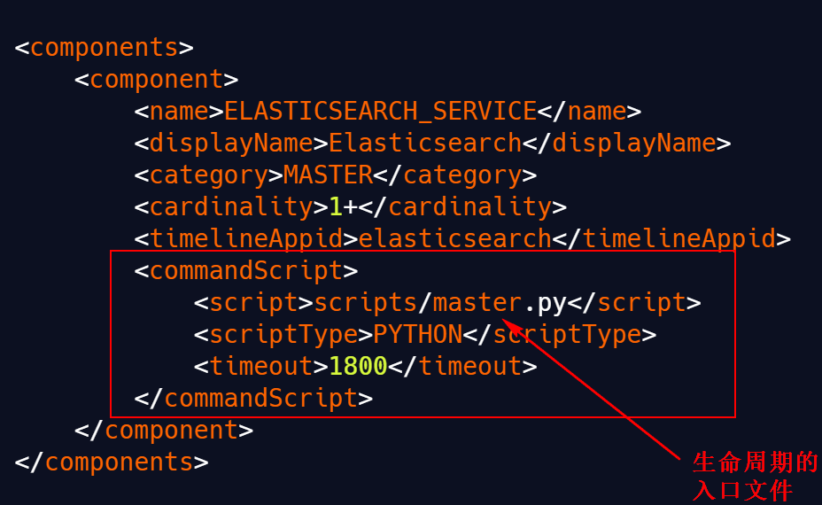
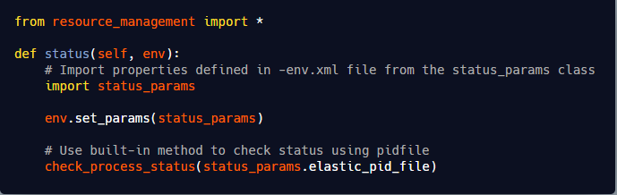
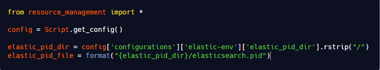

[TOC]
- [Ambari二次开发内容整理](#ambari二次开发内容整理)
  - [架构](#架构)
  - [rpm包解压命令](#rpm包解压命令)
  - [ambari目录结构](#ambari目录结构)
    - [ambari-server](#ambari-server)
    - [ambari-agent](#ambari-agent)
  - [自定义服务的集成原理](#自定义服务的集成原理)
  - [自定义服务的项目结构](#自定义服务的项目结构)
  - [metainfo.xml详解](#metainfoxml详解)
    - [详细描述](#详细描述)
  - [configuration作用](#configuration作用)
    - [elastic-config.xml](#elastic-configxml)
    - [elastic-env.xml](#elastic-envxml)
    - [xml文件详解](#xml文件详解)
    - [配置文件修改后提示重启服务](#配置文件修改后提示重启服务)
    - [配置版本](#配置版本)
  - [Python包详解](#python包详解)
    - [获取页面的配置信息](#获取页面的配置信息)
    - [获取ambari集群配置信息](#获取ambari集群配置信息)
      - [default方法获取属性值](#default方法获取属性值)
    - [通过python执行shell语句](#通过python执行shell语句)
    - [通过python创建文件夹和创建文件](#通过python创建文件夹和创建文件)
    - [通过python删除文件夹和创建文件](#通过python删除文件夹和创建文件)
  - [ambari自定义服务生命周期管理](#ambari自定义服务生命周期管理)
  - [页面上添加修改服务配置](#页面上添加修改服务配置)


---

# Ambari二次开发内容整理
## 架构
主从架构，管理动作是从ambari-agent执行组件的start命令
## rpm包解压命令
rpm2cpio ambari-server-2.7.5.0-72.x86_64.rpm | cpio -div
## ambari目录结构
### ambari-server
1. etc:
   - ambari-server的一些配置，init和init.d是ambari-server的启动命令，可以通过这里面的命令实现ambari-server的启动停止等
2. user：
   - user/lib/ambari-server/web: ambari-server前端的编译后的源码
   - user/lib/ambari-server/lib/resource-managent: python的公共类库，自定义的python脚本会用到这里面的启动停止方法
3. var:
   - var/lib/ambari-server/resources/common-services: 公共服务
   - var/lib/ambari-server/resources/stacks: 会继承公共服务
   - var/lib/ambari-server/resources/stacks/HDP: 版本，这里使用的版本是3.1的版本
   - var/lib/ambari-server/resources/stacks/HDP/services: 很多服务，其他的服务是继承的3.0和上面的版本
4. 最主要的目录：
   - var/lib/ambari-server/resources：自定义服务的存放地址
   - user/lib/ambari-server/lib/resource-managent：公共类库

### ambari-agent
1. etc:
   - ambari-agent的一些配置，init和init.d是ambari-agent的启动命令，可以通过这里面的命令实现ambari-agent的启动停止等
2. user:
   - user/lib/ambari-server/lib/resource-managent: python的公共类库，自定义的python脚本会用到这里面的启动停止方法
3. var:
   - var/lib/ambari-agent/cache/common-services: 很多组件服务
   -  var/lib/ambari-agent/cache/stacks/HDP: 版本，这里使用的版本是3.1的版本


## 自定义服务的集成原理
1. python脚本开发
2. 使用resource-managent来完成自定义的集成
3. var/lib/ambari-server/resources/stacks选择和hdp安装的版本，在这里放自定义的项目
4. /var/lib/ambari-server/resources/stacks/HDP/3.1/services放入我们自定义的组件内容


## 自定义服务的项目结构
1. metainfo.xml：重中之重，自定义名称，组件，启动命令使用那个python脚本等
2. package：
    - /var/lib/ambari-server/resources/stacks/HDP/3.1/services/ES/package/scripts:存放python脚本和模板
    - /var/lib/ambari-server/resources/stacks/HDP/3.1/services/ES/configuration:比如让用户在前端界面可视化的控制配置，在这里创建xml文件，里面都是k，v的形式
    - /var/lib/ambari-server/resources/stacks/HDP/3.1/services/ES/quicklinks：json文件约束
    - /var/lib/ambari-server/resources/stacks/HDP/3.1/services/ES/thems：每个配置的前端样式，都是json文件约束的
    - /var/lib/ambari-server/resources/stacks/HDP/3.1/services/ES/alerts.json：配置告警
    - /var/lib/ambari-server/resources/stacks/HDP/3.1/services/ES/mertics.json:监控指标
    - /var/lib/ambari-server/resources/stacks/HDP/3.1/services/ES/widgeys.json:监控指标
    - /var/lib/ambari-server/resources/stacks/HDP/3.1/services/ES/role_command_order.json：HDP的顺序的约束配置就是通过这个json来实现的
    

---
## metainfo.xml详解
```xml
<?xml version="1.0"?>
<metainfo>
    <schemaVersion>2.0</schemaVersion>
    <services>
        <service>
            <!-- 名称 -->
            <name>ELASTICSEARCH</name>
            <!-- ambari添加服务列表中对应的 -->
            <displayName>Elasticsearch</displayName>
            <comment>Elasticsearch是一个基于Lucene的搜索服务。它提供了一个基于RESTful web接口的分布式多用户全文检索引擎。</comment>
            <version>6.4.0</version>
            <!-- 组件的相关信息 -->
            <components>
                <component>
                    <name>ELASTICSEARCH_SERVICE</name>
                    <!-- ambariWeb页面上显示的服务名称 -->
                    <displayName>Elasticsearch Service</displayName>
                    <!-- 组件的类别，MASTER、SLAVE、CLIENT -->
                    <category>MASTER</category>
                    <cardinality>1+</cardinality>
                    <timelineAppid>elasticsearch</timelineAppid>
                    <!-- 服务主程序 -->
                    <commandScript>
                        <script>scripts/master.py</script>
                        <scriptType>PYTHON</scriptType>
                        <timeout>1800</timeout>
                    </commandScript>
                    <customCommands>
                        <customCommand>
                            <name>test_master_check</name>
                            <background>true</background>
                            <commandScript>
                                <script>scripts/master.py</script>
                                <scriptType>PYTHON</scriptType>
                            </commandScript>
                        </customCommand>
                    </customCommands>
                </component>
                <component>
                    <name>ELASTICSEARCH_HEAD</name>
                    <displayName>Elasticsearch Head</displayName>
                    <category>MASTER</category>
                    <cardinality>1</cardinality>
                    <timelineAppid>elasticsearch</timelineAppid>o
                    <commandScript>
                        <script>scripts/head.py</script>
                        <scriptType>PYTHON</scriptType>
                        <timeout>1800</timeout>
                    </commandScript>
                    <customCommands>
                        <customCommand>
                            <name>test_head_check</name>
                            <background>true</background>
                            <commandScript>
                                <script>scripts/head.py</script>
                                <scriptType>PYTHON</scriptType>
                            </commandScript>
                        </customCommand>
                    </customCommands>
                </component>
                <component>
                    <name>ELASTICSEARCH_CLIENT</name>
                    <displayName>ELASTICSEARCH Client</displayName>
                    <category>CLIENT</category>
                    <cardinality>1+</cardinality>
                    <versionAdvertised>true</versionAdvertised>
                    <commandScript>
                        <script>scripts/elasticsearch_client.py</script>
                        <scriptType>PYTHON</scriptType>
                    </commandScript>
                    <!-- 下载操作，用户可以下载这个配置文件 -->
                    <configFiles>
                        <configFile>
                            <type>xml</type>
                            <fileName>elastic-config.xml</fileName>
                            <dictionaryName>elastic-config</dictionaryName>
                        </configFile>
                        <configFile>
                            <type>xml</type>
                            <fileName>elastic-env.xml</fileName>
                            <dictionaryName>elastic-env</dictionaryName>
                        </configFile>
                        <configFile>
                            <type>env</type>
                            <fileName>elasticsearch.yml</fileName>
                            <dictionaryName>elastic-config</dictionaryName>
                        </configFile>
                        <configFile>
                            <type>properties</type>
                            <fileName>elastic-env.conf</fileName>
                            <dictionaryName>elastic-env</dictionaryName>
                        </configFile>
                    </configFiles>
                    <!-- 这个放在这里表示的是当修改了elastic-env命令后会重启这个ELASTICSEARCH_CLIENT组件，而不是整个服务的重启 -->
<!--                    <configuration-dependencies>-->
<!--                        <config-type>elastic-env</config-type>-->
<!--                        <config-type>elastic-config</config-type>-->
<!--                    </configuration-dependencies>-->
                </component>
            </components>
            <!-- 运行文件检查 -->
            <commandScript>
                <script>scripts/service_check.py</script>
                <scriptType>PYTHON</scriptType>
                <timeout>1800</timeout>
            </commandScript>


            <osSpecifics>
                <osSpecific>
                    <osFamily>any</osFamily>
                </osSpecific>
            </osSpecifics>

            <!--            <configuration-dir>configuration-mapred</configuration-dir>-->
            <!-- 当xml文件中内容在前端修改之后点击保存后，会有一个重启按钮 -->
            <!-- 这个放在这里表示的是当修改了elastic-env和elastic-config后会重启整个服务，对应configuration目录下内容 -->
            <configuration-dependencies>
                <config-type>elastic-env</config-type>
                <config-type>elastic-config</config-type>
            </configuration-dependencies>

            <!-- 只使用theme_elasticsearch_version_4.json这个文件的前端主题样式 -->
            <themes-dir>themes</themes-dir>
            <themes>
                <theme>
                    <fileName>theme_elasticsearch_version_4.json</fileName>
                    <default>true</default>
                </theme>
            </themes>

            <!--            <quickLinksConfigurations-dir>quicklinks-mapred</quickLinksConfigurations-dir>-->
            <!-- 设置quicklinks -->
            <quickLinksConfigurations>
                <quickLinksConfiguration>
                    <fileName>quicklinks-es.json</fileName>
                    <default>true</default>
                </quickLinksConfiguration>
            </quickLinksConfigurations>

            <!--需要前置安装的服务，随便举的例子，假设Elasticsearch服务依赖zookeeper服务-->
<!--            <requiredServices>-->
<!--                <service>ZOOKEEPER</service>-->
<!--            </requiredServices>-->
        </service>
    </services>
</metainfo>

```

### 详细描述
1. 描述服务 \<service> 的字段包括

| 属性                         | 描述                                                                                                                                              |
|------------------------------|---------------------------------------------------------------------------------------------------------------------------------------------------|
| name                         | 服务名，必须唯一，建议大写                                                                                                                        |
| displayName                  | 服务在 web UI 上的显示名                                                                                                                          |
| comment                      | 服务的描述信息                                                                                                                                    |
| version                      | 服务版本，用 name 和 version 唯一标记一个服务                                                                                                     |
| components                   | 服务中包含的组件                                                                                                                                  |
| commandScript（可选)         | 自定义命令 python 脚本入口，如果一个 Service 的 metainfo.xml 有该字段，那么在 Service 的 Action 列表中就会出现自定义命令。                      |
| requiredServices（可选）     | 集群上强制依赖的其他服务。换句话说，安装当前服务之前，必须安装 requiredServices 内指定的服务。                                                  |
| configuration-dependencies（可选） | 服务依赖的 xml 文件，当在前端页面上修改 xml 文件内容后并保存配置，服务会提示重启，服务下的所有组件都将被重启。                              |
| quickLinksConfigurations（可选） | 自定义快速链接，通常在这里设置服务 web UI 链接。                                                                                             |
| osSpecifics（可选）          | 服务会根据操作系统的差异来选择不同的 rpm 包                                                                                                        |
| themes（可选）               | 指定主题配置，通常和 json 文件相关联。                                                                                                            |

2. service/components – 一个服务包含几个组件

| 属性                        | 说明                                                                                                                                              |
|-----------------------------|---------------------------------------------------------------------------------------------------------------------------------------------------|
| name                        | 组件名                                                                                                                                            |
| displayName                 | 组件的显示名                                                                                                                                      |
| category                    | 指定了该组件（Component）的类别，可以是 MASTER、SLAVE、CLIENT。                                                                                    |
| commandScript               | 标准命令，调用 python 脚本，用来执行该组件的某些操作                                                                                              |
| cardinality                 | 指的是所要安装的机器数，可以是固定数字 1，可以是一个范围比如 1-2，也可以是 1+、0+、ALL 或者是一个范围，进行服务安装向导的时候会限制选择的机器数。   |
| versionAdvertised（可选）   | 是否宣称版本，用于回滚和升级                                                                                                                      |
| timelineAppid（可选）       | 存储 metric 数据的默认类型                                                                                                                        |
| configuration-dependencies（可选） | 组件依赖的 xml 文件，当在前端页面上修改 xml 文件内容后并保存配置，服务会提示重启，只有该组件将被重启。                                      |
| customCommands（可选）      | 标准命令之外自定义的命令                                                                                                                          |
| configFiles（可选）         | 客户端配置可以下载的配置文件                                                                                                                      |
3. service/component/customCommand - 添加到组件的自定义命令
   
| 属性                        | 描述                                                                                                                                              |
|-----------------------------|---------------------------------------------------------------------------------------------------------------------------------------------------|
| name                        | 自定义命令名称                                                                                                                                    |
| commandScript               | 实现自定义命令的脚本                                                                                                                              |
| commandScript/script        | 脚本路径                                                                                                                                          |
| commandScript/scriptType（可选） | 脚本类型，目前只支持 python                                                                                                                  |
| commandScript/timeout（可选） | 自定义命令超时时间                                                                                                                              |
4. service/component/configFiles – 客户端配置可以下载的配置文件

| 属性       | 描述                                |
|------------|-------------------------------------|
| type       | 下载文件类型, xml, env, sh, yaml, etc |
| fileName   | 下载的文件文件名                     |
| dictionary | 包含配置属性的数据字典                |

5. service/osSpecifics - 操作系统特定包名 rpm 包

| 属性                                 | 描述                                                  |
|--------------------------------------|-------------------------------------------------------|
| osSpecific/osFamily                  | rpm 包适用的操作系统                                  |
| osSpecific/packages/package/name     | 部署服务需要的包名，将执行 `yum install xxx` 命令     |

6. service/quickLinksConfigurations

| 属性                                                              | 描述                                                                                                                     |
|-------------------------------------------------------------------|--------------------------------------------------------------------------------------------------------------------------|
| service/quickLinksConfigurations-dir                              | 可选字段。用于告诉 Ambari Server 在哪里加载 xxx.json 文件。如果我们希望服务使用默认的 quicklinks 目录，则可以跳过它。   |
| service/quickLinksConfigurations/quickLinksConfiguration/fileName | json 文件，指定的 quickLink 文件名称                                                                                     |
| service/quickLinksConfigurations/quickLinksConfiguration/default  | 一般为 true                                                                                                              |

7. service/configuration-dependencies

| 属性                                              | 描述                                                                                                                         |
|---------------------------------------------------|------------------------------------------------------------------------------------------------------------------------------|
| service/configuration-dir                         | 可选字段。用于告诉 Ambari Server 在哪里加载 xxx.xml 文件。如果我们希望服务使用默认的 configuration 目录，则可以跳过它。     |
| service/configuration-dependencies/config-type    | 服务依赖的配置文件名称。如果在前端页面上修改了该 xml 文件内容后并保存配置，服务会提示重启，整个服务都将被重启。             |

8. service/themes

| 属性                                | 描述                                                                                                                     |
|-------------------------------------|--------------------------------------------------------------------------------------------------------------------------|
| service/themes-dir                  | 可选字段。用于告诉 Ambari Server 在哪里加载 xxx.json 文件。如果我们希望服务使用默认的 themes 目录，则可以跳过它。        |
| service/themes/theme/fileName       | json 文件，指定的主题文件名称                                                                                            |
| service/themes/theme/default        | 一般为 true                                                                                                              |


## configuration作用

xml中的文件都会在configuration目录下，xml文件中的大部分的属性都会在web ui的configs下展示

xml 被 Ambari Server 加载之后，在前端页面上会出现两个配置项，分别是 高级选项 和 自定义选项。其中 高级选项 里面就是 xml 文件的内容，自定义选项 可以加入自定义配置信息，如果不需要显示自定义配置信息的话，可以通过添加 \<configuration supports_adding_forbidden="true"> 来隐藏掉自定义配置信息。

### elastic-config.xml
```xml
<?xml version="1.0"?>
<?xml-stylesheet type="text/xsl" href="configuration.xsl"?>
<configuration supports_adding_forbidden="true">
    <!-- 下面每个Property就是一行 -->
    <!-- Cluster -->
    <property>
        <name>cluster_name</name>
        <display-name>集群名称</display-name><!-- 前端页面显示的值 -->
        <value>elasticsearch</value>
        <description>Elasticsearch集群名称</description>
        <!-- 配置项锁定，服务安装后不可以编辑 -->
<!--        <value-attributes>-->
<!--            <editable-only-at-install>true</editable-only-at-install>-->
<!--        </value-attributes>-->
    </property>

    <!-- Node -->
    <property>
        <name>node_attr_rack</name>
        <display-name>Node attr rack</display-name>
        <value>/default-rack</value>
        <description>Add custom attributes to the node</description>
        <!-- 允许这个配置的值为空 -->
<!--        <value-attributes>-->
<!--            <empty-value-valid>true</empty-value-valid>-->
<!--        </value-attributes>-->
    </property>

    <!-- Paths -->
    <property>
        <name>path_data</name>
        <display-name>Path data</display-name>
        <value>/elasticsearch/data</value>
        <description>Path to directory where to store the data (separate multiple directory by comma)</description>
        <final>true</final>
        <value-attributes>
            <type>directories</type>
            <!--<overridable>false</overridable>-->
        </value-attributes>
        <on-ambari-upgrade add="true"/>
    </property>

    <!-- Memory -->
    <property>
        <name>bootstrap_memory_lock</name>
        <display-name>Bootstrap memory lock</display-name>
        <value>false</value>
        <description>Whether memory is locked on elasticsearch startup</description>
        <value-attributes>
            <overridable>false</overridable>
            <type>value-list</type>
            <entries>
                <entry>
                    <value>true</value>
                    <label>ON</label>
                </entry>
                <entry>
                    <value>false</value>
                    <label>OFF</label>
                </entry>
            </entries>
            <selection-cardinality>1</selection-cardinality>
        </value-attributes>
    </property>
    <property>
        <name>bootstrap_system_call_filter</name>
        <display-name>Bootstrap system call filter</display-name>
        <value>false</value>
        <description>Whether check SecComp on elasticsearch startup</description>
        <value-attributes>
            <overridable>false</overridable>
            <type>value-list</type>
            <entries>
                <entry>
                    <value>true</value>
                    <label>ON</label>
                </entry>
                <entry>
                    <value>false</value>
                    <label>OFF</label>
                </entry>
            </entries>
            <selection-cardinality>1</selection-cardinality>
        </value-attributes>
    </property>

    <!-- Network -->
    <!--<property>-->
    <!--<name>network_host</name>-->
    <!--<value>{{hostname}}</value>-->
    <!--<description>Set the bind address to a specific IP (IPv4 or IPv6)</description>-->
    <!--</property>-->

    <property>
        <name>elasticsearch_port</name>
        <display-name>Elasticsearch port</display-name>
        <value>9200</value>
        <description>Elasticsearch port</description>
    </property>

    <property>
        <name>elasticsearch_head_port</name>
        <display-name>Elasticsearch head port</display-name>
        <value>9100</value>
        <description>Elasticsearch head port</description>
    </property>

    <property>
        <name>content</name>
        <display-name>Elasticsearch config file template</display-name>
        <description>This is the template for elasticsearch.yml file</description>
        <value>
# ======================== Elasticsearch Configuration =========================
#
# NOTE: Elasticsearch comes with reasonable defaults for most settings.
# Before you set out to tweak and tune the configuration, make sure you
# understand what are you trying to accomplish and the consequences.
#
# The primary way of configuring a node is via this file. This template lists
# the most important settings you may want to configure for a production cluster.
#
# Please see the documentation for further information on configuration options:

# ---------------------------------- Cluster -----------------------------------
# Use a descriptive name for your cluster:
cluster.name: {{cluster_name}}

# ------------------------------------ Node ------------------------------------
# Use a descriptive name for the node:
node.name: {{hostname}}

# Add custom attributes to the node:
node.attr.rack: {{node_attr_rack}}

# ----------------------------------- Paths ------------------------------------
# Path to directory where to store the data (separate multiple locations by comma):
path.data: {{path_data}}

# Path to log files:
path.logs: {{elastic_log_dir}}

# ----------------------------------- Memory -----------------------------------
#
# Lock the memory on startup:
#
bootstrap.memory_lock: {{bootstrap_memory_lock}}

# ---------------------------------- Network -----------------------------------
# Set the bind address to a specific IP (IPv4 or IPv6):
network.host: {{hostname}}

# Set a custom port for HTTP:
http.port: {{elasticsearch_port}}
transport.tcp.port: 9300

# ----------------------------------- Head Requires -----------------------------------
http.cors.enabled: {{http_cors_enabled}}
http.cors.allow-origin: "{{http_cors_allow_origin}}"
# --------------------------------- Discovery ----------------------------------
# Pass an initial list of hosts to perform discovery when new node is started:
# The default list of hosts is ["127.0.0.1", "[::1]"]
discovery.zen.ping.unicast.hosts: {{discovery_zen_ping_unicast_hosts}}

# Prevent the "split brain" by configuring the majority of nodes (total number of nodes / 2 + 1):
discovery.zen.minimum_master_nodes: {{discovery_zen_minimum_master_nodes}}

# ---------------------------------- Gateway -----------------------------------
#
# Block initial recovery after a full cluster restart until N nodes are started:
#
gateway.recover_after_nodes: {{gateway_recover_after_nodes}}
#
# For more information, consult the gateway module documentation.
#
# ---------------------------------- Various 123-----------------------------------
#
# Require explicit names when deleting indices:
#
action.destructive_requires_name: {{action_destructive_requires_name}}



discovery.zen.ping_timeout: {{discovery_zen_ping_timeout}}s

        </value>
        <value-attributes>
            <type>content</type>
            <show-property-name>true</show-property-name>
        </value-attributes>
        <on-ambari-upgrade add="true"/>
    </property>

    <!-- Discovery -->
    <!--<property>-->
    <!--<name>discovery_zen_ping_unicast_hosts</name>-->
    <!--<value></value>-->
    <!--<description>Pass an initial list of hosts to perform discovery when new node is started</description>-->
    <!--</property>-->

    <!--<property>-->
    <!--<name>discovery_zen_minimum_master_nodes</name>-->
    <!--<value>1</value>-->
    <!--<description>Prevent the "split brain" by configuring the majority of nodes (total number of nodes / 2 + 1)</description>-->
    <!--</property>-->

    <!-- Head Requires -->
    <property>
        <name>http_cors_enabled</name>
        <display-name>Http cors enabled</display-name>
        <value>true</value>
        <description>Whether to support cross-domain</description>
        <value-attributes>
            <overridable>false</overridable>
            <type>value-list</type>
            <entries>
                <entry>
                    <value>true</value>
                    <label>ON</label>
                </entry>
                <entry>
                    <value>false</value>
                    <label>OFF</label>
                </entry>
            </entries>
            <selection-cardinality>1</selection-cardinality>
        </value-attributes>
    </property>

    <property>
        <name>http_cors_allow_origin</name>
        <display-name>Http cors allow origin</display-name>
        <value>*</value>
        <description>Allow cross-domain, default is "*", indicating support for all domain names.</description>
    </property>

    <!--<property>-->
    <!--<name>http.cors.allow-headers</name>-->
    <!--<value>"Authorization"</value>-->
    <!--<description>X-pack authorization</description>-->
    <!--</property>-->

    <!-- Gateway -->
    <property>
        <name>gateway_recover_after_nodes</name>
        <display-name>Gateway recover after nodes</display-name>
        <value>1</value>
        <description>Allow Initialization Recovery after N Nodes Start</description>
        <final>true</final>
        <value-attributes>
            <type>int</type>
            <minimum>0</minimum>
            <maximum>6</maximum>
            <increment-step>1</increment-step>
        </value-attributes>
    </property>

    <!-- Various -->
    <property>
        <name>node_max_local_storage_nodes</name>
        <display-name>Node max local storage nodes</display-name>
        <value>1</value>
        <description>Set the number of elasticsearch nodes that a machine can run, usually using the default of 1.
        </description>
        <final>true</final>
        <value-attributes>
            <type>int</type>
            <minimum>0</minimum>
            <maximum>6</maximum>
            <increment-step>1</increment-step>
        </value-attributes>
        <on-ambari-upgrade add="true"/>
    </property>

    <!--index.number_of_replicas-->
    <property>
        <name>discovery_zen_ping_timeout</name>
        <display-name>discovery.zen.ping.timeout</display-name>
        <value>10</value>
        <description>discovery zen ping timeout</description>
        <value-attributes>
            <type>int</type>
            <minimum>1</minimum>
            <maximum>30</maximum>
            <increment-step>1</increment-step>
        </value-attributes>
        <on-ambari-upgrade add="true"/>
    </property>

    <property>
        <name>ping_timeout_default</name>
        <display-name>ping timeout default</display-name>
        <value>true</value>
        <description>...</description>
        <value-attributes>
            <overridable>false</overridable>
            <type>value-list</type>
            <entries>
                <entry>
                    <value>true</value>
                    <label>ON</label>
                </entry>
                <entry>
                    <value>false</value>
                    <label>OFF</label>
                </entry>
            </entries>
            <selection-cardinality>1</selection-cardinality>
        </value-attributes>
    </property>

    <property>
        <name>action_destructive_requires_name</name>
        <display-name>Action destructive requires name</display-name>
        <value>false</value>
        <description>When deleting an index, do you need to specify a name explicitly? When the value is false, it can
            be deleted by regular or _all.
        </description>
        <value-attributes>
            <overridable>false</overridable>
            <type>value-list</type>
            <entries>
                <entry>
                    <value>true</value>
                    <label>ON</label>
                </entry>
                <entry>
                    <value>false</value>
                    <label>OFF</label>
                </entry>
            </entries>
            <selection-cardinality>1</selection-cardinality>
        </value-attributes>
        <on-ambari-upgrade add="true"/>
    </property>

    <property>
        <name>es.head.http.policy</name>
        <value>HTTP_ONLY</value>
        <description>
            This configures the HTTP endpoint for Elasticsearch Head Daemons.The following values are supported: -
            HTTP_ONLY : Service is provided only on http - HTTPS_ONLY : Service is provided only on https
        </description>
    </property>
    <property>
        <name>zookeeper.session.timeout</name>
        <value>90000</value>
        <description>ZooKeeper session timeout.
            ZooKeeper session timeout in milliseconds. It is used in two different ways.
            First, this value is used in the ZK client that HBase uses to connect to the ensemble.
            It is also used by HBase when it starts a ZK server and it is passed as the 'maxSessionTimeout'. See
            http://hadoop.apache.org/zookeeper/docs/current/zookeeperProgrammers.html#ch_zkSessions.
            For example, if a HBase region server connects to a ZK ensemble that's also managed by HBase, then the
            session timeout will be the one specified by this configuration. But, a region server that connects
            to an ensemble managed with a different configuration will be subjected that ensemble's maxSessionTimeout.
            So,
            even though HBase might propose using 90 seconds, the ensemble can have a max timeout lower than this and
            it will take precedence.
        </description>
        <display-name>Zookeeper Session Timeout</display-name>
        <value-attributes>
            <type>int</type>
            <minimum>10000</minimum>
            <maximum>180000</maximum>
            <unit>milliseconds</unit>
            <increment-step>10000</increment-step>
        </value-attributes>
        <on-ambari-upgrade add="false"/>
    </property>
    <property>
        <name>hbase.hregion.majorcompaction</name>
        <value>604800000</value>
        <description>Time between major compactions, expressed in milliseconds. Set to 0 to disable
            time-based automatic major compactions. User-requested and size-based major compactions will
            still run. This value is multiplied by hbase.hregion.majorcompaction.jitter to cause
            compaction to start at a somewhat-random time during a given window of time. The default value
            is 7 days, expressed in milliseconds. If major compactions are causing disruption in your
            environment, you can configure them to run at off-peak times for your deployment, or disable
            time-based major compactions by setting this parameter to 0, and run major compactions in a
            cron job or by another external mechanism.
        </description>
        <display-name>Major Compaction Interval</display-name>
        <value-attributes>
            <type>int</type>
            <minimum>0</minimum>
            <maximum>2592000000</maximum>
            <unit>milliseconds</unit>
        </value-attributes>
        <on-ambari-upgrade add="false"/>
    </property>
</configuration>
```

### elastic-env.xml
```xml
<?xml version="1.0"?>
<?xml-stylesheet type="text/xsl" href="configuration.xsl"?>
<!--
   Licensed to the Apache Software Foundation (ASF) under one or more
   contributor license agreements.  See the NOTICE file distributed with
   this work for additional information regarding copyright ownership.
   The ASF licenses this file to You under the Apache License, Version 2.0
   (the "License"); you may not use this file except in compliance with
   the License.  You may obtain a copy of the License at
       http://www.apache.org/licenses/LICENSE-2.0
   Unless required by applicable law or agreed to in writing, software
   distributed under the License is distributed on an "AS IS" BASIS,
   WITHOUT WARRANTIES OR CONDITIONS OF ANY KIND, either express or implied.
   See the License for the specific language governing permissions and
   limitations under the License.
-->
<configuration supports_adding_forbidden="true">

    <!-- 自动创建用户和用户组 -->
    <property>
        <name>elastic_user</name>
        <display-name>Elasticsearch user</display-name>
        <value>es</value>
        <description>Elasticsearch user</description>
        <property-type>USER</property-type>
        <value-attributes>
            <type>user</type>
            <overridable>false</overridable>
            <user-groups>
                <property>
                    <!-- 指定这个用户属于哪个用户组 -->
                    <type>cluster-env</type>
                    <name>user_group</name>
                </property>
                <property>
                    <type>elastic-env</type>
                    <name>es_group</name>
                </property>
            </user-groups>
        </value-attributes>
    </property>

    <property>
        <name>es_group</name>
        <display-name>es User Group</display-name>
        <value>elasticsearch_group</value>
        <property-type>GROUP</property-type>
        <description>es user group.</description>
    </property>

    <property>
        <name>elastic_log_dir</name>
        <display-name>Elasticsearch log directory</display-name>
        <value>/var/log/elasticsearch</value>
        <description>Elasticsearch log directory</description>
    </property>

    <property>
        <name>elastic_pid_dir</name>
        <display-name>Elasticsearch pid directory</display-name>
        <value>/var/run/elasticsearch</value>
        <description>Elasticsearch pid directory</description>
    </property>

    <property>
        <name>elastic_head_pid_dir</name>
        <display-name>Elasticsearch Head pid directory</display-name>
        <value>/var/run/elasticsearch-head</value>
        <description>Elasticsearch Head pid directory</description>
    </property>

</configuration>
```

### xml文件详解

```xml
<?xml version="1.0"?>
<?xml-stylesheet type="text/xsl" href="configuration.xsl"?>
<configuration>
    
    <!-- Cluster -->
    <property>
        <name>cluster_name</name>
        <display-name>Cluster name</display-name>
        <value>elasticsearch</value>
        <description>Elasticsearch cluster name</description>
    </property>
    
</configuration>
```
\<property> 下属性解释说明：

- name：属性名称。当无 display-name 属性时，name 值将会显示在前端页面上。
- display-name：前端页面显示的名称，会覆盖显示在前端页面上的 name 值。
- value：属性值。前端页面对应 输入框 里面的值，可修改并保存。
- description：属性描述信息。在前端页面上以鼠标悬浮框的形式显示出来。

1. 配置项锁定（服务安装后不可编辑）：

    在 <property> 标签内添加：
    ```xml
    <value-attributes>
        <editable-only-at-install>true</editable-only-at-install>
    </value-attributes>
    ```
2. 允许字段值为空（默认情况下，字段值为空在安装页面会告警提示）：
   
   在 <property> 标签内添加：
   ```xml
   <value-attributes>
        <empty-value-valid>true</empty-value-valid>
   </value-attributes>
    ```
3. 密码校验
   
    ```xml
    <property require-input="true">
        <name>kadmin.local.password</name>
        <display-name>admin password</display-name>
        <value/>
        <property-type>PASSWORD</property-type>
        <description>The password is used to add the kerberos database administrator</description>
        <value-attributes>
            <type>password</type>
        </value-attributes>
    </property>
    ```
4. switch 开关
   
   ```xml
    <property>
        <name>hue-hdfs-module-enabled</name>
        <value>Yes</value>
        <display-name>Hue HDFS Module</display-name>
        <description>Enable Hue Filebrower Module</description>
        <value-attributes>
            <overridable>false</overridable>
            <type>value-list</type>
            <entries>
                <entry>
                    <value>Yes</value>
                    <label>ON</label>
                </entry>
                <entry>
                    <value>No</value>
                    <label>OFF</label>
                </entry>
            </entries>
            <selection-cardinality>1</selection-cardinality>
        </value-attributes>
    </property> 

   ```
   

5. 开关量
   
   ```xml
    <property>
        <name>kyuubi.ha.enabled</name>
        <value>true</value>
        <value-attributes>
        <type>boolean</type>
        </value-attributes>
        <description>这是属性描述</description>
    </property>
   ```


6. 去除自定义配置
   ```xml
   <configuration supports_adding_forbidden="true">
   ```

7. 显示配置名称
   
    ```xml
    <value-attributes>
        <!-- 默认为input输入框，当type为content时，即为文本框 -->
        <type>content</type>
        <!-- 是否显示配置名称 -->
        <show-property-name>true</show-property-name>
    </value-attributes>
    ```

8. 目录类型
   
   ```xml
    <value-attributes>
        <!-- 默认为目录输入框 -->
        <type>directories</type>
    </value-attributes>
   ```

9. 自动创建用户和用户组
    ```xml
        <property>
        <name>elastic_user</name>
        <display-name>Elasticsearch user</display-name>
        <value>es</value>
        <description>Elasticsearch user</description>
        <property-type>USER</property-type>
        <value-attributes>
            <type>user</type>
            <user-groups>
                <property>
                    <type>cluster-env</type>
                    <name>user_group</name>
                </property>
                <property>
                    <type>elastic-env</type>
                    <name>es_group</name>
                </property>
            </user-groups>
        </value-attributes>
    </property>

    <property>
        <name>es_group</name>
        <display-name>es User Group</display-name>
        <value>elasticsearch_group</value>
        <property-type>GROUP</property-type>
        <description>es user group.</description>
    </property>
    ```
这样设置的话，会创建名为 es 的用户，并归属于 hadoop 和 elasticseaech_group 用户组。

### 配置文件修改后提示重启服务
 ```xml
    <?xml version="1.0"?>
    <metainfo>
        <schemaVersion>2.0</schemaVersion>
        <services>
            <service>
                ...(省略)
                
                <components>
                    <component>
                        <name>ELASTICSEARCH_SERVICE</name>
                        <displayName>Elasticsearch Service</displayName>
                        <category>MASTER</category>
                        <cardinality>1+</cardinality>
                        ...(省略)
                        
                        <configuration-dir>configuration</configuration-dir>
                        <configuration-dependencies>
                            <config-type>elastic-config</config-type>
                        </configuration-dependencies>
                        
                        ...(省略)
                    </component>
                </components>      
                
                <configuration-dir>configuration</configuration-dir>
                <configuration-dependencies>
                    <config-type>elastic-env</config-type>
                </configuration-dependencies>
                
                ...(省略)
            </service>
        </services>
    </metainfo>
```
 详情查看前面的示例，分为整个服务重启和单个组件重启两种方式

### 配置版本
配置修改记录会保存到 ambari 数据库中，主要涉及到的表有：

- serviceconfig
- serviceconfigmapping
- clusterconfig（历史配置的详细内容）

用于查看历史版本，回溯历史版本version


## Python包详解
开头都会引入resource_management中的类库
这个类库的位置在ambari-server和ambari-agent的lib目录下都有：
- ambari-server/lib/resource_management/
- ambari-agent/lib/resource_management/

可以获取自定义服务页面上的配置信息和ambari集群的相关配置信息，使用python执行shell语句，使用python创建删除文件夹和文件


在 Ambari web 页面上，我们打开 自定义服务 的 配置 页面，会发现上面显示的配置和 configuration 下的 xml 文件内容是一致的

### 获取页面的配置信息
使用Script.get_config()获取configuration目录下的里面的xml文件名里面的一个property的name就可以获取到value值了



### 获取ambari集群配置信息
通过ambariLevelParams的java_home获取当前版本

通过get_ambari_properties的hostname获取主机名
....


这里有个缺点，如果要获取的配置不存在的话程序就会报错，我们可以换个友好的获取属性值的方法。

#### default方法获取属性值
更加安全的方法获取属性值

```python
from resource_management.libraries.functions.default import default
```




### 通过python执行shell语句
Execute

```python
from resource_management.core.resources.system import Execute
```



Execute方法还可以指定执行用户以及失败后是否忽略


### 通过python创建文件夹和创建文件




### 通过python删除文件夹和创建文件




## ambari自定义服务生命周期管理
在Add service中添加服务可以对服务的默认值进行修改，也可以在安装后的configs标签后对服务进行更改


包括，启动停止重启安装卸载监听等

在metainfo.xml中的component标签下面有commandScript，指定了组件运行时候使用的python文件




- 安装install():
  
  ambari2.6需要在这个install中添加创建用户的命令，而ambari2.7不需要，ambari2.7在configuration的目录下的xml文件属性中设进行添加
- 配置configure():
  
  这个方法没有被ambari默认触发，而是在install，start，restart方法里面调用，主要是执行配置，创建相关目录，设置目录的用户组和用户，更改服务配置使用

- 启动start():
  
  会调用configure()启动服务

- 停止stop():
  
- 监听status():
  
  使用ambari的resource_management中的check_process_status判断服务状态
  也就是监测一个pid文件里面的进程号是不是当前正在运行的进程号来监测启动状态

  

  status_params.py文件中的内容是
  

- 重启restart():
  
  当文件没有restart方法会先执行stop再执行start，当有restart方法时，会直接执行restart方法

- 卸载
  
  ambari的卸载没有方法，有一张叫 clusterservices 的表，里面存放着已安装服务的相关数据。
  删除应用就是删除这个表中的内容，只是做了逻辑删除并没有真正的删除，目录还是一直在的


## 页面上添加修改服务配置


